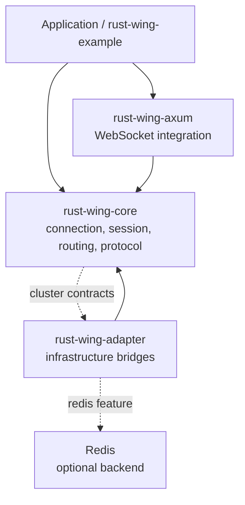
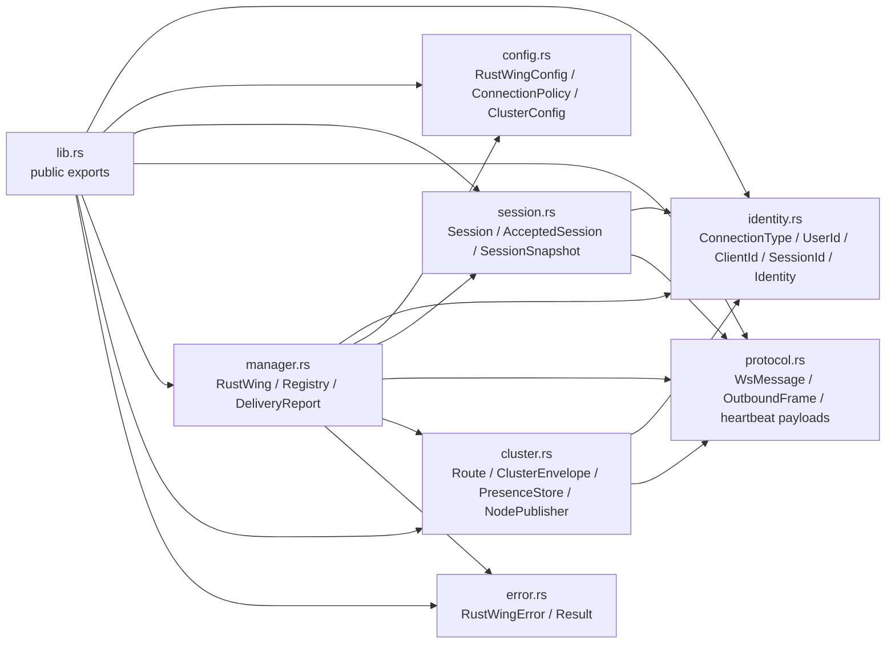
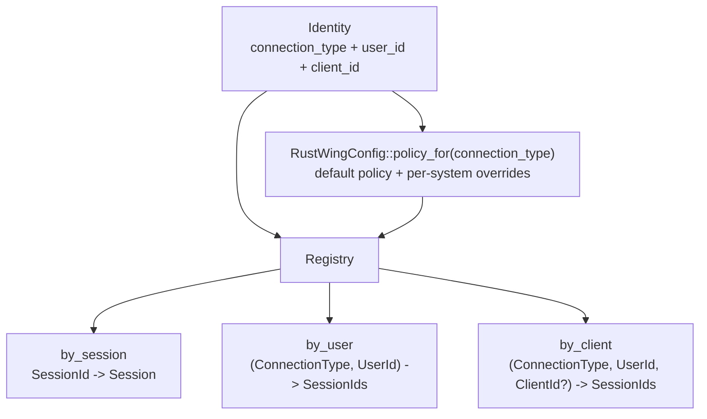
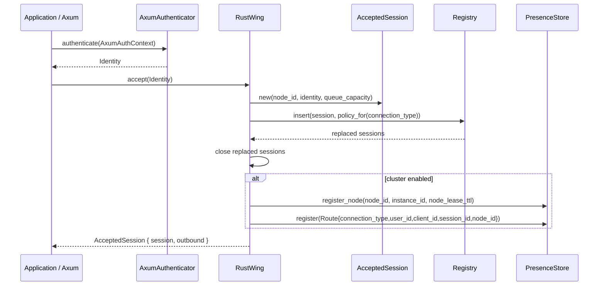
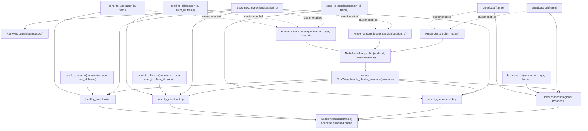
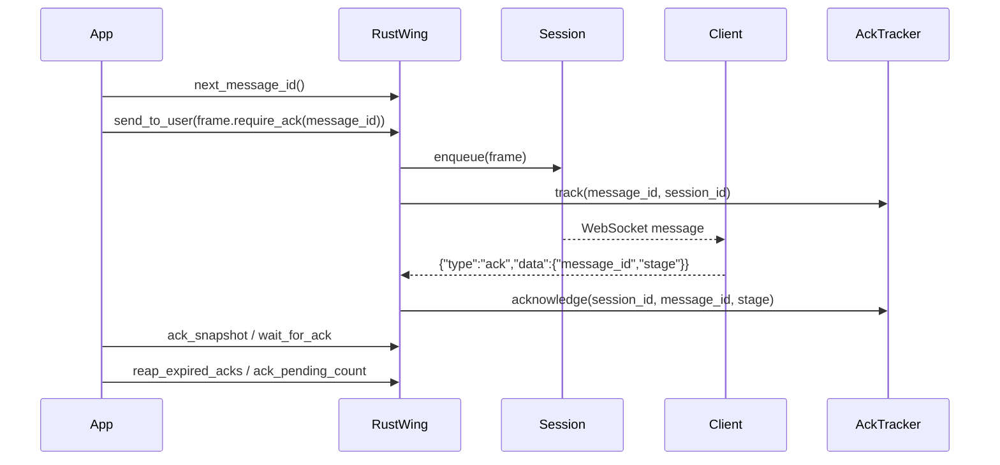
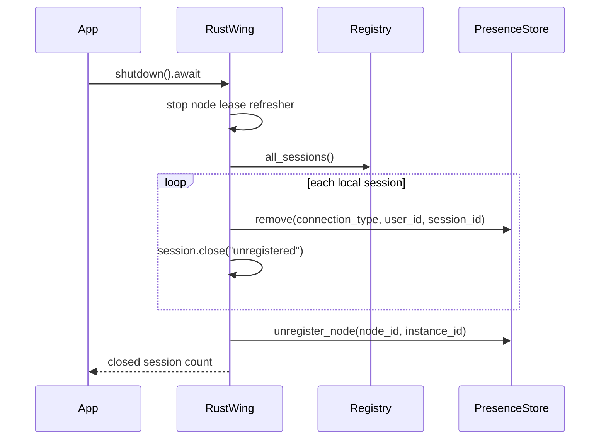
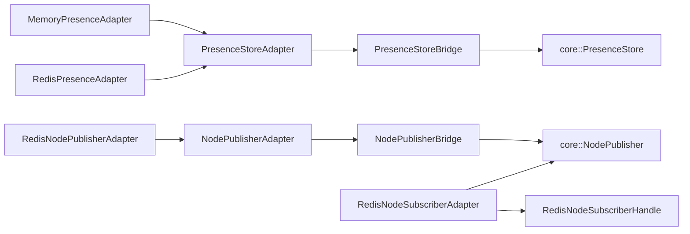
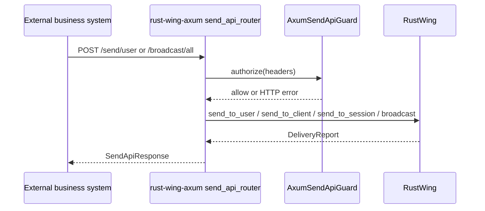
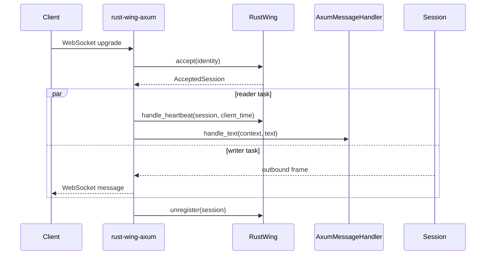

# RustWing Source Architecture

This document shows the current source architecture after the multi-connection-system model landed.

## Workspace View

## Core Modules

## Multi-Connection Registry

## Accept Flow

## Delivery Flow

## Acknowledgement Flow

## Shutdown Flow

## Adapter Layer

## External Send API

## Axum Integration

